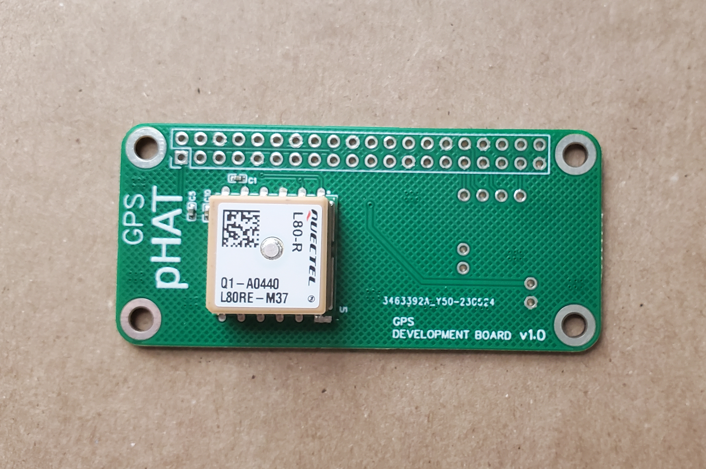
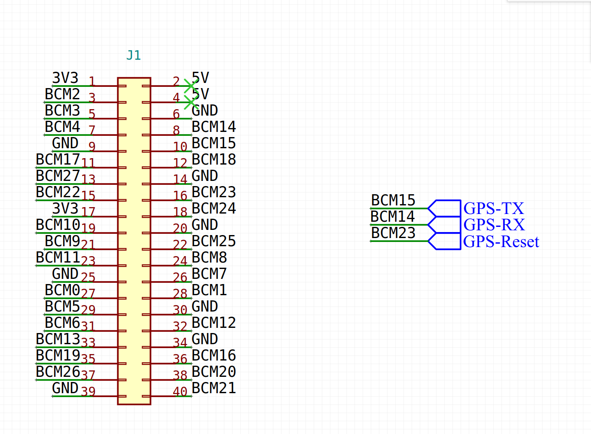

# gps-pHAT

Plug-n-play GPS board for the raspberry pi platform.

# header pinout

# gps module communication
The gps module is available via the UART/Serial port on the raspberry pi.

See the gps examples that demonstrate basic usage.

You will need to install and configure the GPSd package and the gpsd-clients package on the raspberry pi device.

> sudo apt-get -y install gpsd gpsd-clients

Then you will need to configure the gpsd service to use the correct UART port.

1) Edit the /etc/default/gpsd file (as root)

2) Find the DEVICES="" line and change that to ... DEVICES="/dev/ttyAMA0"

3) restart the gps service
> sudo systemctl restart gpsd.socket

At this point the gps service is installed, configured and running.

You will be able to use the python example code to read gps data.

> python3 basic_read.py

Note: the example code uses python version 3
